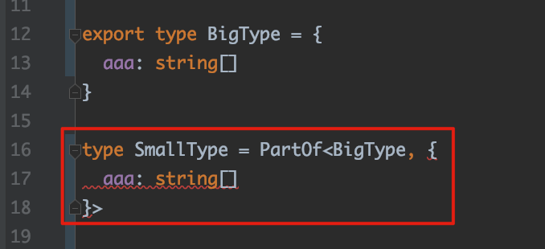

TypeScript Typing keyofStringsOnly Issue Demo
============================================

When set `"keyofStringsOnly": true` in `tsconfig.json`, WebStorm show compilation errors:



But `tsc` doesn't report it

```
npm install
npm run compile
```
